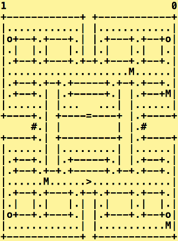
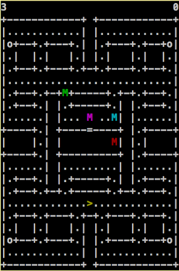
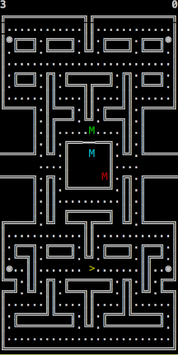

[](https://travis-ci.org/chrisesharp/pacman-kata/)

# pacman-kata

This kata is designed to make some interesting game mechanics, parsing and
rendering, and behaviours, by addressing the feature files one at a time.

## Building and Testing
To build and test a particular language version, using your own platform's dev
environment, type:
```
make local-{lang}
```
where `{lang}` can be `java`, `node`, `go`, `python`.

To build and test using docker containers to encapsulate the dev environment
(in case you don't have a particular language installed) type:
```
make docker-{lang}
```
where `{lang}` can be `java`, `node`, `go`, `python`.

If you look at the `Makefile` you'll see you can target specific steps of
`clean`,`build`,`test` and `deploy` for each language. What these steps mean is
specific to each language.

The output of the docker builds means you can run your game implementation as a
docker container, like this:
`docker run --rm -it {lang}-pacman`
where {lang} can be `java`, `node`, `go`, `python`.

## Getting started with developing a solution
If you set the ENVIRONMENT variable `BDD` to anything, then make will switch off running tests against all features and only run those matching the tag.

e.g.
```
export BDD=@test
make test-java
```
will only test the java implementation with the first feature.
```
unset BDD
make test-java
```
will test the java implementation with all features.

See below for more info...

## Developing using BDD
The features are tagged, to enable a way to incrementally add features to test.
The first feature is tagged `@test`.

The order that I recommend in developing this implementation of the kata,
are as follows:
* Parsing
* Rendering
* Movement
* Pills
* Collision
* Panic
* Control
* Gate
* Level
* WrapAround
* Display
* LevelMaps
* Animation

The structure of this repo is described in more detail [here]
(ReposStructure.md)

Once the basic features were implemented, I then focused on refactoring
extensively to clean the code.



I also added colour support in, just for fun!




for finding better chars to use for the maps, and designing a much more
accurate sample maze!


